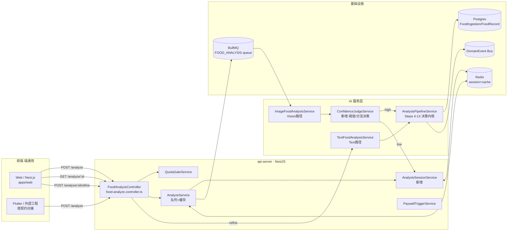
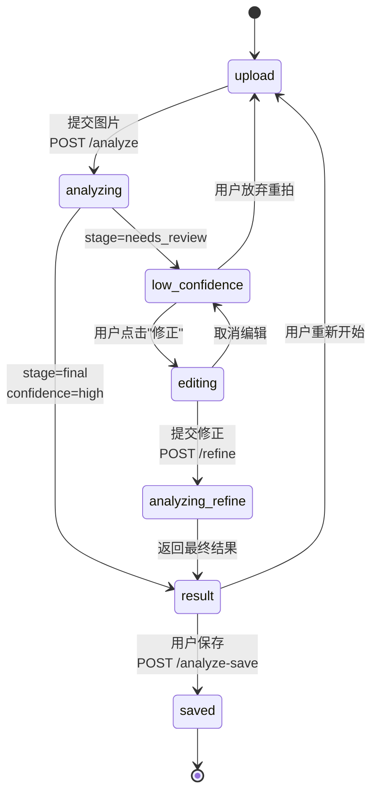

# 置信度驱动的 AI 饮食图片分析系统 V1

> **状态**：设计草案 · v1.0 · 2026-04-24
> **适用**：AI 饮食分析「图片 → 识别 → 营养决策」主链路
> **目标**：通过置信度分流机制，高置信度直接出结果、低置信度引导用户修正后再出最终营养，整条链路（图片识别 + 修正 + 文本重算）**只计一次配额**
> **前端通用性**：本设计在后端接口与状态机层面**端无关**。文档中 Web（Next.js, `apps/web`）为首发落地端；Flutter 客户端按同一 API/状态机映射即可接入，不在本期实施范围。
> **不在范围**：Taro 小程序（`apps/miniapp`）暂不改造。

---

## 目录

1. [设计动机与核心目标](#一设计动机与核心目标)
2. [完整流程设计](#二完整流程设计)
3. [系统架构](#三系统架构)
4. [接口设计（生产可用 JSON Schema）](#四接口设计)
5. [前端交互与状态机](#五前端交互与状态机)
6. [降低 Hallucination 的关键策略](#六降低-hallucination-的关键策略)
7. [可扩展方向（多模型 / 校准 / 用户反哺）](#七可扩展方向)
8. [实施计划与兼容性](#八实施计划与兼容性)

---

## 一、设计动机与核心目标

### 1.1 现状问题

当前图片食物分析链路（`POST /api/app/food/analyze`）无论模型置信度高低，**都会走完整 V6.1 决策 pipeline 并一次性返回完整营养 + 决策结果**，存在三大问题：

| 问题                           | 具体表现                                                                                                                 | 影响                                                         |
| ------------------------------ | ------------------------------------------------------------------------------------------------------------------------ | ------------------------------------------------------------ |
| **低置信度时仍给权威结论**     | AI 把一盘炒饭识别成"盖饭"、把"半只鸡"识别成"200g 鸡胸肉"，依然生成 kcal/GI 全套数据并贴上"该吃/不该吃"结论                | 用户误以为数据准确，长期形成错误饮食认知；**系统可信度受损** |
| **没有用户修正回路**           | 用户即使看出识别错了，也只能**重新拍照**（再次消耗 AI 配额）或**转用文本输入**（又消耗一次配额）                          | 用户体验差 + 配额无谓消耗，付费墙触发率虚高                  |
| **配额模型与用户心智不一致**   | `AI_IMAGE_ANALYSIS` 和 `AI_TEXT_ANALYSIS` 独立计次，导致"我就想记一顿饭"的用户被计费 2-3 次                               | 付费转化受阻，订阅感知"扣次太频繁"                           |

### 1.2 设计目标

1. **可靠性优先**：识别不准时，**不假装准确**——仅返回食物列表让用户确认，避免把 hallucinated 营养数据当权威结论推给用户
2. **一次任务一次配额**：图片识别 → 用户修正 → 文本重算，构成同一个 **Analysis Session**，无论多少步、只扣一次 AI 配额
3. **状态机清晰**：前端状态严格与后端 `stage` 字段对齐，移动端/Web 端 UI 行为可预测、可测试
4. **渐进增强，不破坏存量**：现有 `requestId` 轮询、`save-analysis`、历史查询接口**协议兼容**，仅扩展字段
5. **端通用**：REST + 轮询协议不依赖任何前端框架，Flutter、Web、Taro 可共用

### 1.3 核心概念

| 概念                     | 定义                                                                                                      |
| ------------------------ | --------------------------------------------------------------------------------------------------------- |
| **Analysis Session**     | 一次用户"我想记录/分析这餐"的完整意图，从图片上传到最终 `final` 结果为止。由 `analysisSessionId` 唯一标识 |
| **Stage**                | 后端告知前端的链路阶段：`analyzing` / `needs_review` / `final`                                            |
| **Confidence Level**     | 基于 `overallConfidence` 的二元分流：`high`（≥阈值）/ `low`（<阈值）                                      |
| **Refine**               | 用户对低置信度识别结果的修正操作；复用 `TextFoodAnalysisService` 生成最终结果，**不扣配额**               |
| **High Threshold**       | 环境变量 `CONFIDENCE_HIGH_THRESHOLD`，默认 `0.75`，决定分流点                                             |

---

## 二、完整流程设计

### 2.1 端到端流程（Mermaid）

```mermaid
flowchart TD
    A[用户选择图片 + mealType] --> B[POST /api/app/food/analyze<br/>扣 AI_IMAGE_ANALYSIS 配额<br/>创建 AnalysisSession]
    B --> C[异步 BullMQ 队列<br/>ImageFoodAnalysisService]
    C --> D[Vision Model<br/>OpenRouter / ernie-4.5-vl-28b-a3b]
    D --> E[解析 foods + per-item confidence<br/>匹配食物库 matchFoodsToLibrary]
    E --> F{overallConfidence<br/>≥ 0.75?}

    F -- 高置信度 --> G[走完整 AnalysisPipeline<br/>Steps 4-13: 评分/决策/持久化]
    G --> H[stage = final<br/>返回完整 FoodAnalysisResultV61]

    F -- 低置信度 --> I[stage = needs_review<br/>仅返回 foods[] 骨架<br/>暂不持久化 FoodIngestion]
    I --> J[前端进入 low_confidence UI]
    J --> K[用户列表式编辑:<br/>改名称/份量/删除/新增]
    K --> L[POST /analyze/:requestId/refine<br/>校验 Session 归属 + 未过期<br/>不扣配额]
    L --> M[拼接 refinedFoods → 描述文本]
    M --> N[TextFoodAnalysisService.analyze<br/>quotaSkipReason = 'refine-session']
    N --> G

    H --> O[前端展示 result<br/>用户可 saveAnalysis]
    O --> P[POST /analyze-save<br/>创建 FoodRecord]

    style F fill:#fff3b0,stroke:#f59e0b
    style I fill:#fecaca,stroke:#dc2626
    style H fill:#bbf7d0,stroke:#16a34a
    style L fill:#dbeafe,stroke:#2563eb
```

### 2.2 关键节点语义

| 节点 | 后端行为                                                                                                            | 配额                                    | 数据库                                         |
| ---- | ------------------------------------------------------------------------------------------------------------------- | --------------------------------------- | ---------------------------------------------- |
| B    | `QuotaGateService.consume(AI_IMAGE_ANALYSIS)` → 创建 `AnalysisSession` 写 Redis（key: `analysis_session:{id}`） | **扣 1 次**                             | Redis only                                     |
| E    | Vision 返回后写 `imageAnalysisRaw` 到 session 缓存；不写 DB                                                         | —                                       | —                                              |
| G    | 走 `AnalysisPipelineService`（持久化 `FoodIngestion` + 事件）                                                     | —                                       | 写 `FoodIngestion`（via `persistAnalysisRecord`） |
| I    | 仅缓存 `rawFoods` 到 session；`FoodIngestion` **此时不写**（避免低质量数据污染库）                                  | —                                       | Redis only                                     |
| L    | 校验 `session.status === 'awaiting_refine'` 且未过期（默认 30 分钟）                                                | **跳过** (`SkipQuotaReason.refineSession`) | —                                              |
| N    | 复用 `TextFoodAnalysisService.analyze()`；内部走 pipeline                                                           | —                                       | 写 `FoodIngestion`                            |
| P    | 复用现有 `analyze-save`                                                                                             | —                                       | 写 `FoodRecord`                                |

### 2.3 生命周期与超时

- **Session TTL**：Redis 30 分钟（与现有 `food_analysis` cache 对齐）
- **Session 状态**：
  - `pending` — 图片上传后队列处理中
  - `awaiting_refine` — 低置信度，等待用户 refine
  - `finalized` — 已出最终结果
  - `abandoned` — 超时或用户显式放弃
- **超时策略**：
  - 用户 30 分钟内未 refine → session 失效；重新上传图片**会再次扣配额**（这是预期行为，防止用户反复薅）
  - 在付费墙显示处告知"修正需在 30 分钟内完成"

---

## 三、系统架构

### 3.1 模块全景图



### 3.2 新增 / 重构的服务

| 服务                                 | 类型 | 职责                                                                                                          |
| ------------------------------------ | ---- | ------------------------------------------------------------------------------------------------------------- |
| `AnalysisSessionService`             | 新增 | 创建/查询/更新/终结 session；封装 Redis 存取；负责 refine 幂等性与配额跳过标记                                |
| `ConfidenceJudgeService`             | 新增 | 读取 `CONFIDENCE_HIGH_THRESHOLD`；基于 `ConfidenceDiagnostics.overallConfidence` 决定走 pipeline 还是 needs_review |
| `ImageFoodAnalysisService`           | 改造 | `executeAnalysis()` 拆分为两阶段：Phase A（Vision→foods，必跑）；Phase B（走 pipeline，仅高置信度触发）       |
| `TextFoodAnalysisService`            | 改造 | 新增 `analyze()` 可选参数 `skipQuotaReason?: 'refine-session'`                                                |
| `FoodAnalyzeController`              | 改造 | 新增 `POST /analyze/:requestId/refine`；`/analyze` 响应扩展 `stage`/`confidence`                              |
| `QuotaGateService`                   | 小改 | 支持 `consume(feature, { skipReason })`；skip 时写审计日志但不扣额                                             |

### 3.3 数据流与职责边界

```
Vision 层 (ImageFoodAnalysisService)
  ↓ 输出: { foods: AnalyzedFoodItem[], rawText, diagnostics }
决策层 (ConfidenceJudgeService)
  ↓ 分流
  ├─[high]→ 决策内核 (AnalysisPipelineService) → FoodAnalysisResultV61 → 持久化
  └─[low]→  Session 服务 (AnalysisSessionService) → 等待 refine
                ↓ refine 到达
                → 拼文本 → Text 层 (TextFoodAnalysisService) → 决策内核 → 持久化
```

**关键设计原则**：
- 决策内核 `AnalysisPipelineService` **不感知 session**，只消费 `AnalyzedFoodItem[]`
- Vision 和 Text 都是"食物识别器"，决策统一由 pipeline 完成
- Session 服务是**流程控制层**，不做业务判断

---

## 四、接口设计

### 4.1 接口清单（新增 / 变更 / 不变）

| 接口                                             | 变化       | 说明                                                |
| ------------------------------------------------ | ---------- | --------------------------------------------------- |
| `POST /api/app/food/analyze`                     | **响应扩展** | 上传图片；扣配额；创建 session；返回 `requestId` + `analysisSessionId` |
| `GET  /api/app/food/analyze/:requestId`          | **响应扩展** | 轮询；响应增加 `stage`/`confidence`；低置信度返回缩减字段 |
| `POST /api/app/food/analyze/:requestId/refine`   | **新增**   | 提交用户修正的 foods，不扣配额                      |
| `POST /api/app/food/analyze-text`                | 小改       | 内部支持 `skipQuotaReason`（仅服务间使用，不对外）  |
| `POST /api/app/food/analyze-save`                | 不变       | 保存为 FoodRecord                                   |
| `GET  /api/app/food/analysis/history`            | 不变       | 历史列表                                            |

### 4.2 数据结构

#### 4.2.1 `Stage` 枚举

```ts
/** 后端驱动的链路阶段（与前端状态机 1:1 对齐） */
export type AnalysisStage =
  | 'analyzing'      // 队列中/Vision 调用中
  | 'needs_review'   // 低置信度，等待用户修正
  | 'final';         // 完整结果就绪

export type AnalysisConfidenceLevel = 'high' | 'low';
```

#### 4.2.2 `AnalysisSession`（Redis 存储结构）

```ts
export interface AnalysisSession {
  id: string;                           // analysisSessionId (UUID)
  userId: string;
  requestId: string;                    // 关联图片分析 requestId
  mealType: MealType;
  status: 'pending' | 'awaiting_refine' | 'finalized' | 'abandoned';
  createdAt: string;                    // ISO
  expiresAt: string;                    // ISO, createdAt + 30min
  quotaConsumed: {
    feature: 'AI_IMAGE_ANALYSIS';
    recordId: string;                   // 配额扣减记录ID，用于审计
  };
  imagePhase: {
    overallConfidence: number;          // 0~1
    confidenceLevel: AnalysisConfidenceLevel;
    rawFoods: AnalyzedFoodItemLite[];   // 低置信度时发给前端的骨架
    diagnostics: ConfidenceDiagnostics;
    imageUrl: string;
  };
  refinePhase?: {
    submittedAt: string;
    refinedFoods: RefinedFoodInput[];
    derivedText: string;                // 拼接给 Text 服务的描述
  };
  finalResultKey?: string;              // Redis 中完整 result 的 cache key
}
```

#### 4.2.3 轻量食物条目（低置信度返回 / 用户提交）

```ts
/** 后端 → 前端（低置信度时返回） */
export interface AnalyzedFoodItemLite {
  id: string;                           // 本次分析内唯一；前端 list key
  name: string;                         // AI 识别的中文名
  quantity: string;                     // e.g. "1 碗" / "约半盘"
  estimatedWeightGrams: number | null;
  confidence: number;                   // 0~1 per-item
  uncertaintyHints?: string[];          // e.g. ["光线较暗", "遮挡严重"]
}

/** 前端 → 后端（refine 提交） */
export interface RefinedFoodInput {
  name: string;                         // 必填：用户最终确认的名称
  quantity?: string;                    // 可选描述：如 "1 大碗"
  estimatedWeightGrams?: number;        // 可选：直接指定克数（优先级最高）
  originalId?: string;                  // 可选：对应 lite.id，用于审计
}
```

### 4.3 接口 JSON 详设

#### 4.3.1 `POST /api/app/food/analyze`（扩展响应）

**请求**：multipart/form-data（不变）
- `image: File`
- `mealType: 'breakfast' | 'lunch' | 'dinner' | 'snack'`
- `contextOverride?: string`（可选，JSON）

**响应（202 Accepted）**：

```json
{
  "requestId": "5d1f8f96-...-img",
  "analysisSessionId": "b4c1e9a0-...-sess",
  "status": "queued",
  "pollUrl": "/api/app/food/analyze/5d1f8f96-...-img",
  "estimatedSeconds": 8
}
```

**错误**：
- `402 PAYMENT_REQUIRED` — 配额耗尽，携带 `paywallTrigger` 字段
- `400 INVALID_IMAGE` — 图片解析失败

#### 4.3.2 `GET /api/app/food/analyze/:requestId`（扩展响应）

**高置信度响应（200 OK）**：

```json
{
  "requestId": "5d1f8f96-...-img",
  "analysisSessionId": "b4c1e9a0-...-sess",
  "stage": "final",
  "confidence": {
    "level": "high",
    "overall": 0.86,
    "threshold": 0.75
  },
  "result": {
    "version": "6.1",
    "foods": [ /* AnalyzedFoodItem[] */ ],
    "score": { /* ... */ },
    "decision": { /* ... */ },
    "confidenceDiagnostics": { /* ... */ }
  }
}
```

**低置信度响应（200 OK）**：

```json
{
  "requestId": "5d1f8f96-...-img",
  "analysisSessionId": "b4c1e9a0-...-sess",
  "stage": "needs_review",
  "confidence": {
    "level": "low",
    "overall": 0.52,
    "threshold": 0.75,
    "reasons": ["lighting_poor", "multiple_overlapping_items"]
  },
  "foods": [
    {
      "id": "f_01",
      "name": "米饭",
      "quantity": "约 1 碗",
      "estimatedWeightGrams": 180,
      "confidence": 0.78,
      "uncertaintyHints": []
    },
    {
      "id": "f_02",
      "name": "红烧肉",
      "quantity": "约 4 块",
      "estimatedWeightGrams": 120,
      "confidence": 0.41,
      "uncertaintyHints": ["与另一菜肴边界模糊"]
    }
  ],
  "refineUrl": "/api/app/food/analyze/5d1f8f96-...-img/refine",
  "expiresAt": "2026-04-24T12:30:00.000Z",
  "imageUrl": "https://cdn.../original.jpg"
}
```

**进行中响应（200 OK）**：

```json
{
  "requestId": "5d1f8f96-...-img",
  "analysisSessionId": "b4c1e9a0-...-sess",
  "stage": "analyzing",
  "progress": {
    "phase": "vision_inference",
    "etaSeconds": 5
  }
}
```

#### 4.3.3 `POST /api/app/food/analyze/:requestId/refine`（新增）

**请求体**：

```json
{
  "analysisSessionId": "b4c1e9a0-...-sess",
  "foods": [
    { "originalId": "f_01", "name": "米饭", "estimatedWeightGrams": 200 },
    { "originalId": "f_02", "name": "红烧肉", "quantity": "3 块", "estimatedWeightGrams": 100 },
    { "name": "青菜", "quantity": "1 小份", "estimatedWeightGrams": 80 }
  ],
  "userNote": "自家做的，糖稍少"
}
```

**响应（200 OK，同步返回最终结果）**：

```json
{
  "requestId": "5d1f8f96-...-img",
  "analysisSessionId": "b4c1e9a0-...-sess",
  "stage": "final",
  "confidence": {
    "level": "high",
    "overall": 0.92,
    "source": "user_refined"
  },
  "result": { /* FoodAnalysisResultV61 完整 */ },
  "quotaConsumed": false
}
```

**错误**：
- `404 SESSION_NOT_FOUND` — session 不存在
- `410 SESSION_EXPIRED` — session 已超时
- `409 SESSION_WRONG_STATUS` — session 不在 `awaiting_refine` 状态（幂等保护）
- `403 FORBIDDEN` — session 不属于当前用户
- `400 INVALID_FOODS` — foods 数组为空或格式错误

### 4.4 DTO（NestJS class-validator）

```ts
// apps/api-server/src/modules/food/app/dto/refine-analysis.dto.ts
import { ArrayMinSize, IsArray, IsInt, IsOptional, IsString, IsUUID, Max, MaxLength, Min, ValidateNested } from 'class-validator';
import { Type } from 'class-transformer';

export class RefinedFoodInputDto {
  @IsString()
  @MaxLength(80)
  name!: string;

  @IsOptional()
  @IsString()
  @MaxLength(40)
  quantity?: string;

  @IsOptional()
  @IsInt()
  @Min(1)
  @Max(5000)
  estimatedWeightGrams?: number;

  @IsOptional()
  @IsString()
  @MaxLength(40)
  originalId?: string;
}

export class RefineAnalysisDto {
  @IsUUID()
  analysisSessionId!: string;

  @IsArray()
  @ArrayMinSize(1)
  @ValidateNested({ each: true })
  @Type(() => RefinedFoodInputDto)
  foods!: RefinedFoodInputDto[];

  @IsOptional()
  @IsString()
  @MaxLength(200)
  userNote?: string;
}
```

### 4.5 文本拼接规则（refine → text）

用户修正的 foods 在后端按以下模板拼成自然语言描述，交给 `TextFoodAnalysisService.analyze()`：

```
模板：{food1描述}、{food2描述}、{food3描述}。{userNote}

每条 food 描述生成规则（优先级从高到低）：
  1. 有 estimatedWeightGrams → "{name} {weight}克"
  2. 有 quantity             → "{name} {quantity}"
  3. 仅 name                 → "{name}"
```

示例：
```
输入：
  [
    { name: "米饭", estimatedWeightGrams: 200 },
    { name: "红烧肉", quantity: "3 块", estimatedWeightGrams: 100 },
    { name: "青菜", quantity: "1 小份" }
  ]
  userNote: "自家做的，糖稍少"

输出描述：
  "米饭 200克、红烧肉 100克、青菜 1 小份。自家做的，糖稍少"
```

### 4.6 配额计数契约

| 场景                               | 扣 `AI_IMAGE_ANALYSIS` | 扣 `AI_TEXT_ANALYSIS` | 备注                     |
| ---------------------------------- | ---------------------- | --------------------- | ------------------------ |
| POST /analyze（首次）              | ✅ 1 次                | ❌                    | 建 session               |
| POST /analyze/:id/refine           | ❌                     | ❌                    | `skipReason=refine-session` |
| POST /analyze-text（直接用户发起） | ❌                     | ✅ 1 次               | 与本链路无关             |
| 首次 session 过期后用户重新上传    | ✅ 1 次                | ❌                    | 新 session               |

---

## 五、前端交互与状态机

### 5.1 端通用状态机



### 5.2 状态详解

| 状态                 | 触发                         | UI 要素                                                                                         | 可操作                                                 |
| -------------------- | ---------------------------- | ----------------------------------------------------------------------------------------------- | ------------------------------------------------------ |
| `upload`             | 入口                         | 拍照/选图按钮、mealType 选择                                                                     | 提交图片                                               |
| `analyzing`          | 图片已上传                   | Loading + 进度提示（"AI 正在识别食物..."）                                                       | 取消                                                   |
| `low_confidence`     | 后端返回 `needs_review`      | **醒目提示条**「识别可能不准确，请核对以获得准确分析」 + 食物骨架卡片 + **原图对照**             | 进入编辑 / 重新拍照 / 放弃                              |
| `editing`            | 用户点击"核对并修正"         | **列表式编辑**：每项可改名称/份量/克数、删除、新增                                              | 提交修正（`Refine`）/ 取消                              |
| `analyzing_refine`   | 提交 refine 后                | Loading（"正在根据你的修正计算营养..."）                                                         | —                                                      |
| `result`             | 后端返回 `final`              | 完整营养卡片、决策建议、confidenceBadge（仅在 user_refined 时显示"已按你的修正计算"）            | 保存 / 重新分析                                        |
| `saved`              | 保存成功                     | 成功提示 + 跳转记录详情                                                                         | 查看记录                                               |

### 5.3 低置信度分支 UI 关键原则

1. **不展示营养数据**（遵守"低置信度不假装准确"原则）
2. **原图对照**：编辑期间保持缩略图可见，用户便于核对
3. **每项 confidence 可视化**：≥0.7 显示"可能是"；<0.7 显示"不太确定"图标 + 颜色提示
4. **编辑摩擦最小化**：
   - 名称用 `input`，支持从食物库联想（复用 `search-input.tsx` 的搜索逻辑）
   - 克数用数字 stepper（50g 步长，长按快进）
   - 份量描述使用 chip 预设（"1 碗"/"半碗"/"1 份"/"1 勺"）
5. **兜底出口**：始终提供"重新拍照"和"放弃"按钮

### 5.4 Web 具体实现映射（`apps/web`）

- **状态机扩展**：`analyze-page.tsx` 的 `Step` 类型
  ```ts
  // 现状
  type Step = 'upload' | 'analyzing' | 'result' | 'saved';
  // 目标
  type Step = 'upload' | 'analyzing' | 'low_confidence' | 'editing' | 'analyzing_refine' | 'result' | 'saved';
  ```
- **新增组件**：`features/food-analysis/components/food-edit-list.tsx`
- **新增 hook 方法**：`useFoodAnalysis().refineAnalysis(requestId, payload)`
- **新增 API 方法**：`lib/api/food-record.ts#refineAnalysis`

### 5.5 Flutter 映射（参考，不在本期实施）

Flutter 端按相同 `Step` 枚举建 `StateNotifier`（Riverpod）或 `Bloc`；`food-edit-list` 对应 `ListView.builder` + `TextEditingController` per item；`PollAnalyzeResult` 使用 `Stream` + `Timer.periodic` 轮询。接口契约与 Web 完全一致。

---

## 六、降低 Hallucination 的关键策略

### 6.1 分层策略总览

| 层级                | 策略                                                                                       | 实施点                              |
| ------------------- | ------------------------------------------------------------------------------------------ | ----------------------------------- |
| **模型输入**        | Vision prompt 强制结构化输出 + **要求模型自评 per-item 与 overall confidence**              | `ImageFoodAnalysisService` prompt   |
| **模型输出**        | Schema 校验 + 异常值兜底（如 weight > 3000g 触发降 confidence）                             | `parseToAnalyzedFoods()`            |
| **后处理校准**      | 多信号融合：`per-item conf` + `food-library match score` + `image quality hints`            | `ConfidenceJudgeService`            |
| **业务分流**        | **低置信度不出营养结论**（本设计核心）                                                     | Pipeline 分支                       |
| **用户回路**        | 修正后走 Text pipeline，文本识别通常比 Vision 可靠                                          | Refine 接口                         |
| **持久化门槛**      | 低置信度 session **不写 FoodIngestion**，避免污染用户画像                                   | `persistAnalysisRecord` 分支        |
| **可观测性**        | 所有分支都打点到 `DomainEventBus`，支持后续校准                                             | 新增 `AnalysisConfidenceJudgedEvent` |

### 6.2 置信度融合算法（`ConfidenceJudgeService`）

```ts
/**
 * 输入：Vision 原始结果
 * 输出：overallConfidence ∈ [0,1]、level、reasons
 */
function judgeConfidence(input: VisionRawResult): ConfidenceJudgement {
  const { foods, qualityBand, hints } = input;

  // 1. per-item 加权平均（按 estimatedWeightGrams 作为权重，大物件权重大）
  const totalWeight = foods.reduce((s, f) => s + (f.estimatedWeightGrams ?? 100), 0);
  const weightedConf = foods.reduce(
    (s, f) => s + f.confidence * ((f.estimatedWeightGrams ?? 100) / totalWeight),
    0,
  );

  // 2. 食物库命中率惩罚（未命中的食物通常是 AI 自创名）
  const matchRate = foods.filter(f => f.libraryMatched).length / foods.length;
  const matchPenalty = matchRate < 0.5 ? 0.85 : 1.0;

  // 3. 图像质量信号惩罚
  const qualityFactor = { high: 1.0, medium: 0.9, low: 0.75 }[qualityBand] ?? 0.9;

  // 4. 食物数量过多惩罚（>6 项通常 AI 拆得过细）
  const countPenalty = foods.length > 6 ? 0.9 : 1.0;

  const overall = clamp01(weightedConf * matchPenalty * qualityFactor * countPenalty);

  const threshold = Number(process.env.CONFIDENCE_HIGH_THRESHOLD ?? 0.75);
  return {
    overallConfidence: overall,
    level: overall >= threshold ? 'high' : 'low',
    threshold,
    reasons: collectLowConfidenceReasons(matchRate, qualityBand, foods),
  };
}
```

### 6.3 Prompt 侧强化（Vision）

在现有 `ImageFoodAnalysisService` prompt 中追加：

```
# 置信度自评要求
- 为每个识别出的食物给出 confidence ∈ [0,1]，表示你对"名称 + 份量"同时正确的主观把握
- 对不确定因素（光线/遮挡/相似食物混淆）在 uncertaintyHints 中说明
- 若图像模糊/非食物/无法识别，必须返回 "unrecognizable": true 而不是编造食物
- 禁止对"可能是"的食物给出高 confidence（>0.7）
```

### 6.4 用户端的 UX 反馈闭环

- 低置信度展示时，**明确告知用户为什么"不准确"**（从 `reasons` 渲染）
- 用户修正后再计算的结果，标记 `confidence.source = 'user_refined'`，UI 显示徽章"已按你的修正计算"
- 高置信度但 `overallConfidence ∈ [0.75, 0.85]` 的边缘情况，在 UI 角标提示"AI 识别结果，如不准可重新分析"

---

## 七、可扩展方向

### 7.1 多模型融合（Ensemble）

**短期（V1.1）**：
- 主模型失败或 confidence < 0.4 时，降级到备用模型（如 `qwen2-vl-72b`）
- 实现点：`ImageFoodAnalysisService.analyzeWithFallback()`

**中期（V1.2）**：
- 两模型并发调用 + **加权投票**：名称匹配则相信，差异大则自动触发 `needs_review`
- 投票权重在 `ConfidenceJudgeService` 扩展

### 7.2 置信度校准（Calibration）

**数据收集**：
- 每次分析发射事件 `AnalysisConfidenceJudgedEvent { sessionId, predictedConfidence, actualOutcome: 'user_accepted' | 'user_edited' | 'user_abandoned' }`
- 离线 job 按周聚合，用 **Platt scaling / isotonic regression** 校准阈值

**动态阈值**：
- 按用户分层：新用户默认阈值 0.8（更保守），活跃用户 0.7（更信任 AI）
- 按食物类别：单一主食类可宽松，混合菜肴严格

### 7.3 用户行为反哺（Feedback Loop）

| 信号            | 来源                       | 用途                                          |
| --------------- | -------------------------- | --------------------------------------------- |
| **用户修正内容** | Refine 接口 `foods` diff   | 训练名称纠错 dataset / 扩充食物库同义词       |
| **用户接受度**  | 高置信度时是否直接 save    | 校准 confidence 真实可靠性                    |
| **克数调整分布** | Refine 中克数变化分布      | 修正 Vision 克数估计偏差（如系统性低估 20%）  |
| **放弃率**      | `abandoned` session 占比   | A/B 测试阈值变更                              |

### 7.4 未来形态（V2+）

- **多轮对话式确认**：对 confidence 中等的单项食物，仅对该项发 1 条 AI 问题"这个是牛肉还是猪肉？"
- **RAG 食物库**：把用户历史常吃食物作为 vision prompt context，提升命中率
- **端侧预过滤**：Flutter / Web 端用轻量模型先判断"是否是食物图片"，非食物图不上传

---

## 八、实施计划与兼容性

### 8.1 阶段划分

| 阶段  | 交付                                                                                                    | 预期工时 |
| ----- | ------------------------------------------------------------------------------------------------------- | -------- |
| **S1 · 设计**（本文档） | 本 Markdown + 契约 review                                                                             | 0.5 d    |
| **S2 · 后端**           | `AnalysisSessionService`、`ConfidenceJudgeService`、Controller 扩展、refine 接口、DTO、单测             | 2 d      |
| **S3 · Web**            | `use-food-analysis` 扩展、`food-edit-list.tsx`、`analyze-page.tsx` 状态机重构                          | 1.5 d    |
| **S4 · 联调 + 灰度**    | e2e 测试、配额审计校对、线上灰度 20% 用户观察 `abandoned` 率                                            | 1 d      |

### 8.2 兼容性承诺

- **老客户端兼容**：`POST /analyze` 响应中若未出现 `stage` 字段，老客户端继续按"直接是最终结果"处理。后端在 `stage === 'final'` 时保持响应体**叠加式扩展**而非重构，老字段保留。
- **未升级端的降级**：
  - 后端通过 `User-Agent` 或 `x-client-version` header 识别老客户端时，低置信度仍走 pipeline，照旧返回完整结果（仅输出 `reviewLevel='manual_review'` 提示），避免老端卡在 `needs_review` 无法消费。
  - Feature flag：`ENABLE_CONFIDENCE_DRIVEN_ANALYSIS`（环境变量），可一键关闭回退到现状逻辑。

### 8.3 观测与回滚

- **关键指标**：
  - `analysis.session.created` / `analysis.session.finalized` / `analysis.session.abandoned` counter
  - `analysis.confidence.distribution` histogram（按 overall 分桶）
  - `analysis.refine.conversion` = finalized / awaiting_refine（期望 > 70%）
- **告警**：
  - 低置信度比例 > 60%（模型异常或阈值过高）
  - Refine 失败率 > 5%
- **回滚**：关闭 feature flag，1 分钟内全量回到现状

### 8.4 风险与对策

| 风险                               | 对策                                                                   |
| ---------------------------------- | ---------------------------------------------------------------------- |
| AI 自评 confidence 过高虚报        | `ConfidenceJudgeService` 融合算法引入多信号惩罚，不单信 AI 自评          |
| 用户嫌 refine 麻烦直接放弃         | UI 编辑摩擦最小化 + 预设 chip；观测 abandoned 率动态调阈值              |
| Session 过期导致付费用户不满       | 过期前 5 分钟本地推送提醒；过期后 1 小时内支持一次"免费重新分析"兜底    |
| Redis 故障丢 session               | Session 写入前先持久化最小恢复单元（`FoodAnalysisRecoveryRecord`）到 DB |

---

## 附录 A：文件清单（实施时触达）

### 后端新增
- `apps/api-server/src/modules/food/app/services/analysis-session.service.ts`
- `apps/api-server/src/modules/food/app/services/confidence-judge.service.ts`
- `apps/api-server/src/modules/food/app/dto/refine-analysis.dto.ts`

### 后端改造
- `apps/api-server/src/modules/food/app/controllers/food-analyze.controller.ts`
- `apps/api-server/src/modules/food/app/services/analyze.service.ts`
- `apps/api-server/src/modules/food/app/services/image-food-analysis.service.ts`
- `apps/api-server/src/modules/food/app/services/text-food-analysis.service.ts`
- `apps/api-server/src/modules/decision/types/analysis.types.ts`（增 `stage` 等）
- `apps/api-server/src/modules/subscription/app/services/quota-gate.service.ts`（`skipReason`）

### Web 新增
- `apps/web/src/features/food-analysis/components/food-edit-list.tsx`

### Web 改造
- `apps/web/src/features/food-analysis/components/analyze-page.tsx`
- `apps/web/src/features/food-analysis/hooks/use-food-analysis.ts`
- `apps/web/src/lib/api/food-record.ts`
- `apps/web/src/types/food.ts`

---

## 附录 B：环境变量清单

| 变量                                  | 默认    | 说明                                         |
| ------------------------------------- | ------- | -------------------------------------------- |
| `CONFIDENCE_HIGH_THRESHOLD`           | `0.75`  | 高/低置信度分流阈值                          |
| `ANALYSIS_SESSION_TTL_SECONDS`        | `1800`  | Session 有效期（秒）                         |
| `ENABLE_CONFIDENCE_DRIVEN_ANALYSIS`   | `true`  | Feature flag，关闭则走旧逻辑                 |
| `CONFIDENCE_IMAGE_MODEL`              | `baidu/ernie-4.5-vl-28b-a3b` | Vision 主模型                 |
| `CONFIDENCE_IMAGE_FALLBACK_MODEL`     | 空      | 可选备用模型，空则不降级                     |

---

**文档结束**。后端实施将从 `AnalysisSessionService` + `ConfidenceJudgeService` 开始；Web 实施从 `food-edit-list.tsx` 组件 + 状态机扩展开始。
